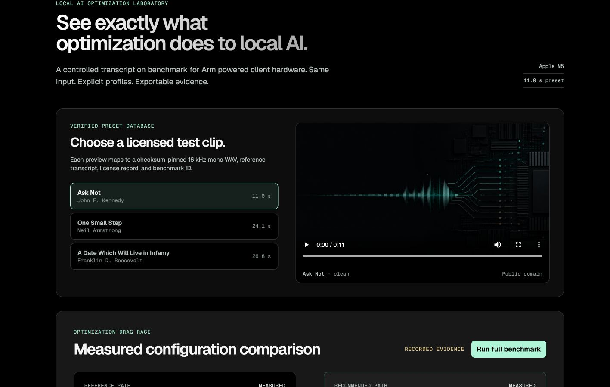

# Pocket Proof

**See exactly what optimization does to local AI.**

[](https://github.com/andrewkernel/pocket-proof/actions/workflows/ci.yml)


Pocket Proof is a local, reproducible optimization laboratory for speech-to-text on Arm-powered client hardware. It turns a controlled FP16→Q4_0 model-quantization experiment into an intelligible product experience: the same audio, binary architecture, and thread count are measured in two sequential lanes, then replayed as an evidence-labelled optimization race.

The project targets the [Arm Create: AI Optimization Challenge Mobile AI track](https://arm-ai-optimization-challenge.devpost.com/details/trackdetails). That track explicitly includes local AI on Arm-powered laptops and names transcription as a candidate workload.

## The claim

`same Whisper small.en task + same 11 s JFK audio + same native arm64 CPU binary + 4 threads`  
`FP16 weights` → `Q4_0 weight quantization`

Both primary lanes use the same Arm [STT-Runner](https://github.com/Arm-Examples/STT-Runner) native `arm64` CPU binary built with `USE_KLEIDIAI=OFF`. This isolates the measured headline to model representation rather than a runtime-library change. STT-Runner wraps `whisper.cpp` and is tested on macOS-aarch64.

Pocket Proof does not treat a concurrent race animation as a benchmark. Runs are sequential and interleaved; the UI identifies its cinematic race as a replay of recorded measurements.

## Results

Measured on an Apple M5 MacBook Pro (macOS 26.5.2, 16 GB), using one warm-up and five measured runs per lane in alternating AB/BA order. The source of truth is [featured report `run-2026-08-13T22-01-38-888Z-c2b8e5df`](public/featured-report.json).

| Measure | FP16 reference | Q4_0 optimized | Observed change |
| --- | ---: | ---: | ---: |
| Median inference time | 2577.86 ms | 1616.44 ms | **1.5948× faster; 37.30% lower latency** |
| Measured inference range | 2541.80–3353.81 ms | 1486.35–1817.50 ms | Five runs per lane |
| Median peak RSS | 791,117,824 B | 445,251,584 B | **43.72% less** |
| Model artifact | 487,614,201 B | 145,471,353 B | **70.17% smaller** |
| Normalized WER | 0 | 0 | Exact transcript match on this clip |

These results are device-, runtime-, model-, input-, and thread-count-specific; they are not a general Whisper or Arm performance claim. The exact output transcript matched in every primary run: “And so, my fellow Americans, ask not what your country can do for you. Ask what you can do for your country.”



### KleidiAI ablation: not the headline

We also ran a separate same-Q4_0, four-thread CPU ablation to isolate KleidiAI: seven interleaved pairs with `USE_KLEIDIAI=OFF` versus `ON`. Mean inference was 1467.81 ms OFF and 1492.94 ms ON—**0.98×** ON/OFF. On this M5 configuration there was no repeatable improvement, so Pocket Proof rejects KleidiAI as the source of the headline result. See [optimization notes](docs/optimization.md).

## Quick start

Prerequisites: native Arm64 macOS, Node.js 22+, CMake 3.27+, Python 3.9+, and sufficient disk space for the selected model. Pocket Proof's automation and measurement adapters currently support macOS arm64 only; upstream STT-Runner supports additional targets that this project has not validated.

```sh
npm ci
./scripts/setup-runtime.sh
npm run benchmark -- --runs 5 --warmup 1 --threads 4
npm run dev
```

The setup script pins Arm STT-Runner, downloads `ggml-small.en.bin`, builds native Arm64 reference and KleidiAI ablation binaries, and derives the Q4_0 artifact. If CMake is installed outside `PATH`, pass its absolute executable path as `CMAKE_BIN=/path/to/cmake ./scripts/setup-runtime.sh`. Open the local address printed by Vite. `npm run benchmark` creates a new immutable, schema-validated JSON report; Judge Mode labels any visual race as a recorded replay. See [reproducibility.md](docs/reproducibility.md) and [methodology.md](docs/methodology.md).

## What is local

After the model and runtime have been provisioned, the benchmark path runs as local native subprocesses. Audio is passed to local inference; Pocket Proof is not an API wrapper. The hardware panel records architecture and binary evidence so a user can distinguish native Arm64 execution from translated execution.

## Documentation

- [Architecture](docs/architecture.md)
- [Optimization contract](docs/optimization.md)
- [Benchmark methodology](docs/methodology.md)
- [Arm platform notes](docs/arm-notes.md)
- [Reproducibility guide](docs/reproducibility.md)
- [Demo script](docs/demo-script.md)
- [Research and sources](docs/research.md)
- [Product design system](docs/design-system.md)
- [Privacy](docs/privacy.md) and [terms](docs/terms.md)
- [Devpost draft](submission/devpost-draft.md) and [submission checklist](submission/checklist.md)

## License and attribution

Pocket Proof is MIT licensed. Runtime, model, and corpus licenses are tracked in [THIRD_PARTY_NOTICES.md](THIRD_PARTY_NOTICES.md). Arm, KleidiAI, macOS, and related marks belong to their respective owners; this project is not endorsed by Arm.
